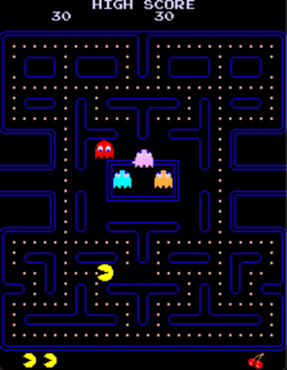

# pac

A [Pac-Man (1980 arcade game)](https://en.wikipedia.org/wiki/Pac-Man) emulator written in C99 with the SDL2.



Features:

- [x] full emulation
- [x] sound
- [x] two-player mode
- [x] joystick support
- [x] web export to HTML5 using emscripten (use `make web`)
- [ ] cocktail mode

The emulator has been tested with Midway Pac-Man (North American ver.):

```
SHA256(82s123.7f)= 48fe0b01d68e3d702019ca715f7266c8e3261c769509b281720f53ca0a1cc8fb
SHA256(82s126.1m)= 8e723ad91e46ef1a186b2ed3c99a8bf1c571786bc7ceae2b367cbfc80857a394
SHA256(82s126.3m)= 8c34002652e587aa19a77bff9040d870af18b4b2fe5c5f0ed962899386e0e751
SHA256(82s126.4a)= ef8f7a3b0c10f787d9cc1cbc5cc266fcc1afadb24c3b4d610fe252b9c3df1d76
SHA256(pacman.5e)= 8d9a86c97fe94b1fd010b139672c330e3b257ba59b0d8df7a821592e30a77b4b
SHA256(pacman.5f)= 49c8f656cb8ea1ae02fb64a2c09df98e7f06a034b43c6c8240032df417c6d36f
SHA256(pacman.6e)= fe1c3234df345855d30728637f361f79472cabfe2a892a7567c63eaf31a4217b
SHA256(pacman.6f)= 09a723c9f84790e9019633e37761cfa4e9d7ab6db14f6fdb12738f51fec11065
SHA256(pacman.6h)= 69347409739b64ed9d9b19713de0bc66627bd137687de649796b9d2ef88ed8e6
SHA256(pacman.6j)= 03ee523c210e87fb8dd1d925b092ad269fdd753b5b7a20b3757b0ceee5f18679
```

## How to build

You should be able to launch it by running `make && ./pac path-to-roms/`. It has been tested on macOS 10.14 with clang and debian 9 with gcc 5.

You can also build it for the web if you have emscripten installed. Just run `make web` to obtain four "pac.(js|wasm|data|html)" files which can be hosted on a web server.

## How to play

Computer | pac
--- | ---
c | insert a coin
return | start a game (1 player)
2 | start a game (2 players)
arrow keys | move the player
p | pause the emulation
m | mute audio
s | take a screenshot
t | run the board test
tab | run the emulation at x5 speed

## Resources

- https://www.lomont.org/software/games/pacman/PacmanEmulation.pdf
- https://www.arcade-history.com/?n=pac-man-model-932&page=detail&id=1914
- http://www.arcaderestoration.com/memorymap/6365/Pac-Man.aspx
- http://umlautllama.com/projects/pacdocs/
- https://simonowen.com/articles/pacemu/
